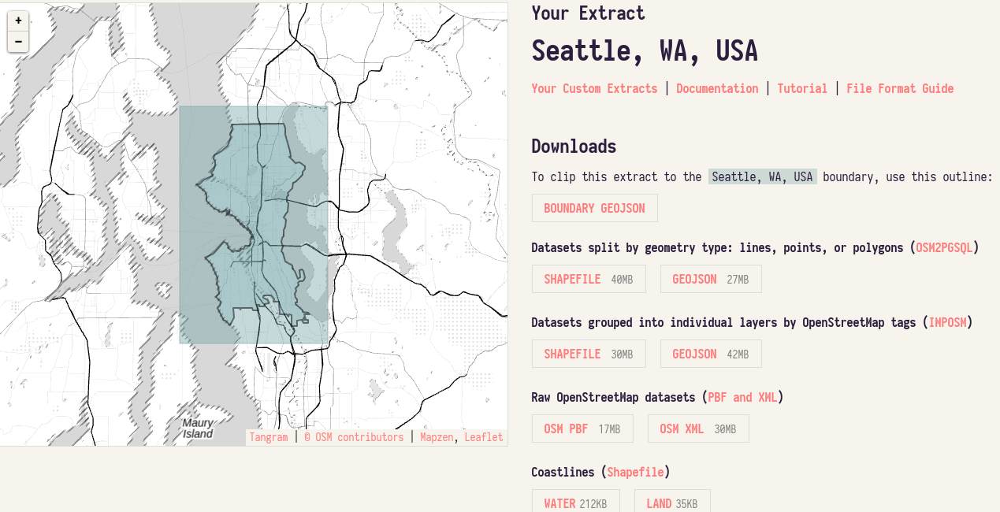
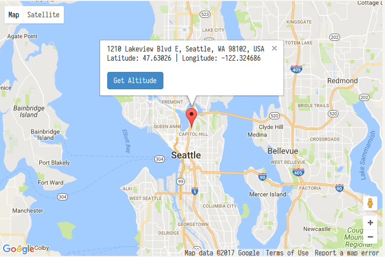

# Map Area
Seattle, WA, USA
 * https://www.openstreetmap.org/relation/237385
 * https://mapzen.com/data/metro-extracts/your-extracts/974ced45a323
 

# Problems Encountered in the Map and Corresponding Corrections
* Over­abbreviated street names (*"S Estelle St"*)
* Inconsistent phone number (*"206-623-4727", "+1 206 405-3560", "(206) 293-6302"*)
* Inconsistent "k" tag with different number of ":" (*'k="amenity"', 'k="addr:street"', 'k="access:lanes:backward"'*)
* Other problems encountered during importing data

#### Over­abbreviated street names
Use abbreviated mapping completed street types dict(*'Ave': 'Avenue'*) and abbreviated mapping completed directions dict(*'S': 'South'*) to make the over­abbreviated street names more completed.
```
def update_street(street_name):
    """Return more completed street name."""
    if isinstance(street_name, list):
        street_name = [update_street(i) for i in street_name]
        return street_name
    st_split = street_name.split()
    if st_split[-1] in directions or st_split[-1] in directions.values():
        street_type = st_split[-2]
        direction_type = st_split[-1]
        if road_types.get(street_type):
            st_split[-2] = road_types.get(street_type)
        if directions.get(direction_type):
            st_split[-1] = directions.get(direction_type)
    else:
        street_type = st_split[-1]
        direction_type = st_split[0]
        if road_types.get(street_type):
            st_split[-1] = road_types.get(street_type)
        if directions.get(direction_type):
            st_split[0] = directions.get(direction_type)
    return ' '.join(st_split)
```

#### Inconsistent phone number
Transform the phone number mainly into format "+1 206-XXX-XXXX" or other toll-free number format like "+1 888-XXX-XXXX" and "911".
```
def update_phone_number(phone):
    """Return formatted phone number."""
    phone_num = re.sub('\D', '', phone)
    if phone_num == '' or phone_num == "911":
        pass
    elif phone_num.startswith('1'):
        phone_num = '+1 ' + phone_num[1:4] + '-' + \
            phone_num[4:7] + '-' + phone_num[7:11]
    elif phone_num.startswith('001'):
        phone_num = '+1 ' + phone_num[3:6] + '-' + \
            phone_num[6:9] + '-' + phone_num[9:13]
    else:
        phone_num = "+1 " + phone_num[0:3] + '-' + \
            phone_num[3:6] + '-' + phone_num[6:10]
    return phone_num
```
#### Inconsistent "k" tag with different number of ":"
For example
```
<node changeset="44226942" id="1725980819" lat="47.662684" lon="-122.2997452" timestamp="2016-12-07T06:25:19Z" uid="2601744" user="sctrojan79" version="4">
    <tag k="name" v="Starbucks" />
    <tag k="phone" v="+1-206-5225228" />
    <tag k="amenity" v="cafe" />
    <tag k="cuisine" v="coffee_shop" />
    <tag k="smoking" v="no" />
    <tag k="website" v="www.starbucks.com" />
    <tag k="takeaway" v="yes" />
    <tag k="addr:city" v="Seattle" />
    <tag k="wheelchair" v="yes" />
    <tag k="addr:street" v="26th Avenue Northeast" />
    <tag k="internet_access" v="yes" />
    <tag k="outdoor_seating" v="yes" />
    <tag k="addr:housenumber" v="4634" />
    <tag k="internet_access:fee" v="no" />
</node>
```
Here is the trouble tag:
```
<tag k="internet_access" v="yes" />
<tag k="internet_access:fee" v="no" />
```
Running this code:
```
if ':' not in key:
    node[key] = tag.get('v')
else:
     key_split = key.split(':')
     if len(key_split) > 2:
         print("multiple':' key: {0}  value: {1}".format(key, tag.get('v')))
     else:
         key1, key2 = set(key_split)
         node[key1][key2] = tag.get('v')
TypeError: 'str' object does not support item assignment
```
Reference: https://stackoverflow.com/questions/27279933/python-add-to-a-dictionary-using-a-string  
The value of node[key1] is defined as the string 'yes'. Now you can only perform string operations with node[key1]. You can't use it as a dictionary now and that's why node[key1][key2] = tag.get('v') fails.

There are two ways to solve this problem:
1. change the node[key1] from str to dict
```
if type(node[key1]) == str:
    value = node[key1]
    del node[key1]
    node[key1][key1] = value
    node[key1][key2] = tag.get('v')
else:                                 
    node[key1][key2] = tag.get('v')
```
2. change the origin key from key1:key2 to key1_key2
```
if type(node[key1]) == str:
    node[key.replace(':', '_')] = tag.get('v')
else:                                 
    node[key1][key2] = tag.get('v')
```        
As for me, I prefer first method.

After scrutinizing the 'k' with more than one ":", I found that you cannot simply use only one method to deal with all the 'k'.

For example:
1. Replace the ':' with '_' as a direct key
```
key: access:lanes:backward value: |no  
key: bus:lanes:backward value: |designated  
key: turn:lanes:both_ways value: left
key: source:addr:id value: 873935
key: parking:lane:both value: parallel
key: destination:ref:to value: WA 509 South
```
change to:
```
"access_lanes_backward": "|no"
"bus_lanes_backward": "|designated"
"turn_lanes_both_ways": "left"
"source_addr_id": "873935"
"parking_lane_both": "parallel"
"destination_ref_to": "WA 509 South"
```
2. Use nested dict and ":" create a subdict
```
key: sdot:bike_rack:id value: BKR-2242
key: sdot:bike_rack:type value: BKR
key: sdot:bike_rack:facility value: SGL
key: sdot:bike_rack:condition value: good
```
change to
```
"sdot_bike_rack": {
  "id": "BKR-2769",
  "type": "BKR",
  "facility": "SGL",
  "condition": "good"
}
```
3. Use nested dict and replace the ':' with '_' as a direct key
```
key: seamark:small_craft_facility:category value: slipway
key: seamark:light:character value: Fl
key: seamark:bridge:clearance_height value: 55.0
key: seamark:harbour:category value: marina
```
change to
```
"seamark": {
  "small_craft_facility:category": "slipway",
  "light_character": "Fl",
  "bridge_clearance_height": "55.0",
  "harbour_category", "marina"
}
```
```
<tag k="opening_hours" v="Mo-Tu closed; We-Th 16:00-23:00; Fr 16:00-24:00; Sa 12:00-24:00; Su 12:00-21:00" />
<tag k="source" v="King County GIS;data.seattle.gov" />
<tag k="old_ref" v="US 10;PSH 2" />
<tag k="turn:lanes" v="left||" />
<tag k="cuisine" v="steak_house;seafood" />
<tag k="tiger:name_base" v="35th; Fort" />
<tag k="seamark:information" v="manually;winch" />
<tag k="bus:lanes" v="yes|yes|yes|designated" />
<tag k="old_ref" v="US 10;US 99 Business (old US 99;PSH 1)" />
```
The tags like these should be turn into dict with list value:
```
{'cuisine': ['steak_house', seafood']}
```
While
```
<tag k="opening_hours" v="Su-Th 12:00-22:00; Fr-Sa 12:00-23:00" />
```
should be transformed into
```
{"opening_hours": [{'Su-Th': '12:00-22:00'}, {'Fr-Sa': '12:00-23:00'}]}
```
by code
```
if tag.get('k') == "opening_hours":
    opening_hours = tag.get('v').split(';')
    opening_hours = list(filter(None, opening_hours))
    opening_hours = [{i.strip().split()[0]: i.strip().split()[1]} for i in opening_hours]
```
But when the program run into this:
```
Mo-Fr 09:00-12:00; 13:00-17:00 Mo-Fr:04:00-17:00;Sa:05:00-13:00
```
and
```
unknown; Dec-Feb off
```
it raise
```
IndexError: list index out of range
````
The whole 500M file have only these three trouble values, I prefer modify these three values manually rather than programmatically.

#### Other problems encountered during importing data.
```
$ grep -A 5 1078239536 Seattle.osm
	<node id="1078239536" lat="47.6613084" lon="-122.3401115" version="2" timestamp="2016-08-04T21:14:10Z" changeset="41247698" uid="2601744" user="sctrojan79">
		<tag k="fee" v="no"/>
		<tag k="note" v="N 45TH ST 0140 BLOCK S SIDE ( 126) 126 FT E/O INTERLAKE AVE N"/>
		<tag k="source" v="SDOT Bike Rack Import 2012;bing;knowledge"/>
		<tag k="amenity" v="bicycle_parking"/>
		<tag k="capacity" v="4"/>
		<tag k="operator" v="SDOT"/>
		<tag k="source:url" v="http://www.http://www.seattle.gov/transportation/bikeprogram.htm"/>
```
```
<tag k="source" v="SDOT Bike Rack Import 2012;bing;knowledge"/>
```  
will transform into {str: list} key-value pair  
```
{"source": ["SDOT Bike Rack Import 2012", "bing" "knowledge"]}
```

So node["source"]["url"] will raise
```
TypeError: list indices must be integers or slices, not str
```

Therefore, modify def update_tag(tag, node) in audit_tag.py
```
elif isinstance(node[key1], str) or isinstance(node[key1], list) \
        or node[key1] is None:
        node_value = node[key1]
        del node[key1]
        node[key1][key1] = node_value
        node[key1][key2] = value
```
```
$ grep -A 6 2373916288 Seattle.osm
	<node id="2373916288" lat="47.5787931" lon="-122.3151443" version="2" timestamp="2016-05-26T13:00:54Z" changeset="39580955" uid="3521724" user="headwatersolver">
		<tag k="source" v="King County GIS;data.seattle.gov"/>
		<tag k="addr:city" v="Seattle"/>
		<tag k="addr:street" v="South Hanford Street;South McClellan Street"/>
		<tag k="addr:postcode" v="98144"/>
		<tag k="addr:housenumber" v="1726;1318"/>
	</node>
```

```
<tag k="addr:street" v="South Hanford Street;South McClellan Street"/>
```  
will transform into  
```
{"address": {"street": ["South Hanford Street", "South McClellan Street"]}}
```

so in
```
def update_street(["South Hanford Street", "South McClellan Street"]):  
    st_split = street_name.split()
```
will raise  
```
AttributeError: 'list' object has no attribute 'split'
```

Therefore, for def update_street(street_name) in audit_street.py,  
add some code to deal with list that contains multiple street_name.
```
if isinstance(street_name, list):
    street_name = [update_street(i) for i in street_name]
    return street_name
```

# Import data
```
$ mongoimport -d osm -c Seattle --file Seattle.osm.json
2017-06-23T22:04:37.567-0400	[########################] osm.Seattle	654MB/654MB (100.0%)  
2017-06-23T22:04:37.567-0400	imported 2723908 documents
```
# Data Overview
```
654M Seattle.osm.json          
538M Seattle.osm              
5.6M Seattle_sample1.osm
```

#### Number of documents
```
>db.Seattle.find().count()                         
2723908
```

#### Number of nodes
```           
> db.Seattle.find({"type":"node"}).count()
2437428
```                                                
#### Number of ways
```
> db.Seattle.find({"type":"way"}).count()
284056
```
#### Number of relations  
```
> db.Seattle.find({"type":"relation"}).count()
2
```

# Data Explore

#### Number of unique users
```
> db.Seattle.distinct("created.user").length  
1176
```
#### Top 10 contributing user
```
> db.Seattle.aggregate([
  {"$group":{"_id": "$created.user", "count": {"$sum": 1}}},
  {"$sort": {"count": -1}},
  {"$limit": 10}
])
{ "_id" : "Glassman", "count" : 927131 }
{ "_id" : "SeattleImport", "count" : 734385 }
{ "_id" : "seattlefyi", "count" : 99249 }
{ "_id" : "sctrojan79", "count" : 93822 }
{ "_id" : "Foundatron", "count" : 61534 }
{ "_id" : "Glassman_Import", "count" : 59719 }
{ "_id" : "zephyr", "count" : 57057 }
{ "_id" : "jeffmeyer", "count" : 52905 }
{ "_id" : "lukobe", "count" : 52777 }
{ "_id" : "Omnific", "count" : 48110 }
```
#### Top 10 appearing amenities
```
> db.Seattle.aggregate([
  {"$match": {"amenity": {"$exists": 1}}},
  {"$group": {"_id": "$amenity", "count": {"$sum": 1}}},
  {"$sort": {"count": -1}},
  {"$limit": 10}
])
{ "_id" : "parking", "count" : 3062 }
{ "_id" : "bicycle_parking", "count" : 3013 }
{ "_id" : "restaurant", "count" : 1221 }
{ "_id" : "bench", "count" : 960 }
{ "_id" : "cafe", "count" : 641 }
{ "_id" : "waste_basket", "count" : 632 }
{ "_id" : "place_of_worship", "count" : 475 }
{ "_id" : "fast_food", "count" : 391 }
{ "_id" : "school", "count" : 300 }
{ "_id" : "bar", "count" : 231 }
```
#### Top 10 popular cuisines
```
> db.Seattle.aggregate([
  {"$match":{"cuisine":{"$exists":1},"amenity":"restaurant"}}, {"$group":{"_id":"$cuisine", "count":{"$sum":1}}}, {"$sort":{"count":-1}},
  {"$limit":10}
])
{ "_id" : "pizza", "count" : 96 }
{ "_id" : "mexican", "count" : 80 }
{ "_id" : "thai", "count" : 74 }
{ "_id" : "american", "count" : 69 }
{ "_id" : "chinese", "count" : 58 }
{ "_id" : "italian", "count" : 56 }
{ "_id" : "vietnamese", "count" : 51 }
{ "_id" : "japanese", "count" : 45 }
{ "_id" : "seafood", "count" : 37 }
{ "_id" : "asian", "count" : 33 }
```          
#### Top 10 setting max speed limit
```
> data = db.Seattle.aggregate([
  {"$match": {"maxspeed": {"$exists": 1}}},
  {"$group": {"_id": "$maxspeed", "count": {"$sum": 1}}},
  {"$sort": {"count": -1}},
  {"$limit": 10}
])
{'_id': '25 mph', 'count': 5134}
{'_id': '30 mph', 'count': 3515}
{'_id': '15 mph', 'count': 1946}
{'_id': '35 mph', 'count': 787}
{'_id': '40 mph', 'count': 334}
{'_id': '60 mph', 'count': 332}
{'_id': '20 mph', 'count': 125}
{'_id': '45 mph', 'count': 110}
{'_id': '50 mph', 'count': 55}
{'_id': '10 mph', 'count': 14}
```
#### Top 10 appearing surface of roads/footpaths
```
> data = db.Seattle.aggregate([
  {"$match": {"surface": {"$exists": 1}}},
  {"$group": {"_id": "$surface", "count": {"$sum": 1}}},
  {"$sort": {"count": -1}},
  {"$limit": 10}
])
{'_id': 'paved', 'count': 1854}
{'_id': 'asphalt', 'count': 1566}
{'_id': 'concrete', 'count': 961}
{'_id': 'ground', 'count': 712}
{'_id': 'gravel', 'count': 420}
{'_id': 'dirt', 'count': 230}
{'_id': 'unpaved', 'count': 123}
{'_id': 'wood', 'count': 119}
{'_id': 'grass', 'count': 104}
{'_id': 'paving_stones', 'count': 46}
```
#### Top 10 appearing natural land features
```
> data = db.Seattle.aggregate([
  {"$match": {"natural": {"$exists": 1}}},
  {"$group": {"_id": "$natural", "count": {"$sum": 1}}},
  {"$sort": {"count": -1}},
  {"$limit": 10}
])
{'_id': 'tree', 'count': 2200}
{'_id': 'wood', 'count': 467}
{'_id': 'water', 'count': 142}
{'_id': 'scrub', 'count': 132}
{'_id': 'sand', 'count': 102}
{'_id': 'wetland', 'count': 102}
{'_id': 'beach', 'count': 96}
{'_id': 'coastline', 'count': 72}
{'_id': 'bay', 'count': 27}
{'_id': 'tree_row', 'count': 22}
```      
#### Top 10 appearing leisure
```
> data = db.Seattle.aggregate([
  {"$match": {"leisure": {"$exists": 1}}},
  {"$group": {"_id": "$leisure", "count": {"$sum": 1}}},
  {"$sort": {"count": -1}},
  {"$limit": 10}
])
{'_id': 'pitch', 'count': 759}
{'_id': 'park', 'count': 628}
{'_id': 'playground', 'count': 346}
{'_id': 'swimming_pool', 'count': 181}
{'_id': 'picnic_table', 'count': 161}
{'_id': 'fitness_centre', 'count': 141}
{'_id': 'garden', 'count': 115}
{'_id': 'sports_centre', 'count': 45}
{'_id': 'slipway', 'count': 39}
{'_id': 'marina', 'count': 34}
```
#### Top 10 land use way
```
> data = db.Seattle.aggregate([
  {"$match": {"landuse": {"$exists": 1}}},
  {"$group": {"_id": "$landuse", "count": {"$sum": 1}}},
  {"$sort": {"count": -1}},
  {"$limit": 10}
])
{'_id': 'grass', 'count': 611}
{'_id': 'residential', 'count': 449}
{'_id': 'construction', 'count': 169}
{'_id': 'retail', 'count': 166}
{'_id': 'commercial', 'count': 131}
{'_id': 'allotments', 'count': 93}
{'_id': 'recreation_ground', 'count': 85}
{'_id': 'industrial', 'count': 72}
{'_id': 'flowerbed', 'count': 62}
{'_id': 'forest', 'count': 41}
```
#### Top 10 sports
```
> data = db.Seattle.aggregate([{"$match": {"sport": {"$exists": 1}}}, {"$group": {"_id": "$sport", "count": {"$sum": 1}}}, {"$sort": {"count": -1}}, {"$limit": 10}])
{'_id': 'tennis', 'count': 261}
{'_id': 'baseball', 'count': 153}
{'_id': 'swimming', 'count': 137}
{'_id': 'basketball', 'count': 114}
{'_id': 'soccer', 'count': 79}
{'_id': 'golf', 'count': 45}
{'_id': 'yoga', 'count': 32}
{'_id': 'fitness', 'count': 20}
{'_id': 'american_football', 'count': 17}
{'_id': 'beachvolleyball', 'count': 15}
```
#### Number of users appearing only once (having 1 post)
```                                                
> db.Seattle.aggregate([
  {"$group":{"_id":"$created.user", "count":{"$sum":1}}},
  {"$group":{"_id":"$count", "num_users":{"$sum":1}}},
  {"$sort":{"_id":1}},
  {"$limit":1}
])
{ "_id" : 1, "num_users" : 303 }
```
#### Biggest religion
```
> db.Seattle.aggregate([
  {"$match":{"amenity":{"$exists":1}, "amenity":"place_of_worship"}},
  {"$group":{"_id":"$religion", "count":{"$sum":1}}},
  {"$sort":{"count":-1}},
  {"$limit":1}
])
{ "_id" : "christian", "count" : 422 }
```
# Additional Ideas

#### Contributor statistics
An additional way to analyze the data would be to take a look at when and how many time the data have been created or modified.  
As time progresses, in addition to adding on previously missing nodes, ways, and relations,
it is important to update old entries to reflect changes in the real world.   
At first, I grouped the "created.version" and found the version 1 have accounted for 91.4%.  
Then, I grouped the entries by year and found the 2013 have accounted for 76.1%.  
Finally, I grouped the entries by year and version. As expected, the 2013 version 1 have accounted for 74.5%.  
In conclusion, most data are created in 2013 and never been modified from then on. Therefore, maybe time to renovate the data since our real world already changed beyond recognition.

#### Cross-validation
Use Google map api to cross-validate open street map data(phone, postal code and street address).
The data set is 400: 1 sample because the request quota of Google Places API Web Service is only 1000 per day.
```
def cross_validate(osmfile):
    """Cross-validating phone, postal code and street address.

    Respectively count the total number of phone, postal code and street
    address in OSM and number of these different itmes in OSM and googlemaps.
    """
    google_address = ''
    osm_address_street = ''
    phone_count = 0
    phone_diff_count = 0
    postal_code_count = 0
    postal_code_diff_count = 0
    address_count = 0
    address_diff_count = 0

    with open(osmfile, "r") as osmf:
        for event, element in ET.iterparse(osmf, events=("start",)):
            if element.tag == "node":
                for tag in element.iter("tag"):
                    key = tag.get('k')
                    if key == "phone" or key == "contact:phone":
                        phone_count += 1
                        place = get_place(element)
                        phone_number = place.get('international_phone_number')
                        if phone_number:
                            osm_phone = update_phone_number(tag.get('v'))
                            if phone_number != osm_phone:
                                phone_diff_count += 1
                                print((phone_number, osm_phone))

                    if key == "postal_code" or key == "addr:postcode":
                        postal_code_count += 1
                        place = get_place(element)
                        formatted_address = place.get('formatted_address')
                        if formatted_address:
                            postal_code = formatted_address[-10:-5]
                            osm_postal_code = tag.get('v')
                            if postal_code != osm_postal_code:
                                postal_code_diff_count += 1
                                print((postal_code, osm_postal_code))

                    if key == "addr:street":
                        address_count += 1
                        place = get_place(element)
                        address = place.get('name')
                        street_list = address.split()[1:]
                        street = ' '.join(street_list)
                        if len(street_list) > 1:
                            google_address_street = update_street(street)
                        else:
                            google_address_street = street
                        google_address_number = address.split()[0]
                        google_address = google_address_number + ' ' \
                            + google_address_street
                        osm_address_street = update_street(tag.get('v'))
                    if key == "addr:housenumber":
                        osm_address_number = tag.get('v').split()[0]
                        osm_address = osm_address_number + ' ' \
                            + osm_address_street
                        if google_address != osm_address:
                            address_diff_count += 1
                            print((google_address, osm_address))

    print(phone_count)
    print(phone_diff_count)
    print(postal_code_count)
    print(postal_code_diff_count)
    print(address_count)
    print(address_diff_count)
```
Part of the results
```
('134 5th Avenue West', '141 7th Avenue West')
('9637 Northeast 121st Lane', '12044 96th Avenue Northeast')
('9711 Northeast 120th Place', '9742 Northeast 119th Way')
('11803 100th Avenue Northeast', '11807 100th Avenue Northeast')
('514 Lake Street South', '515 Lake Street South')
('5569 Lake Washington Boulevard Northeast', '5535 Lake Washington Boulevard Northeast')
('98011', '98034')
('14199 74th Place Northeast', '14146 73rd Place Northeast')
('13215 97th Avenue Northeast', '13217 97th Avenue Northeast')
3
0
166
1
167
98
```
* Benefits
 1. Can use Google map data to correct incorrect data or fill missing data.
 2. Can check the OSM data accuracy(nearly half of the OSM address data are Inconsistent with Google map data)
* Anticipated Issues
 1. The request quota of Google Places API Web Service is only 1000 per day, while there are 2723908 documents.
 2. Google map data miss phone number while OSM data have.
 3. Most of the differences between inconsistent address data are single figures. I cannot see which data set is more reliable.

#### Top 10 appearing data created version
```
> db.Seattle.aggregate([
  {"$match":{"created.version":{"$exists":1}}},
  {"$group":{"_id":"$created.version","count":{"$sum":1}}},
  {"$sort":{"count":-1}}, {"$limit": 10}
])
{'_id': '1', 'count': 2490514}
{'_id': '2', 'count': 142831}
{'_id': '3', 'count': 34803}
{'_id': '4', 'count': 17772}
{'_id': '5', 'count': 11878}
{'_id': '6', 'count': 8179}
{'_id': '7', 'count': 5365}
{'_id': '8', 'count': 3705}
{'_id': '9', 'count': 2386}
{'_id': '10', 'count': 1498}
```
#### Data created year
```
> db.Seattle.aggregate([
    {"$match": {"created.timestamp": {"$exists": 1}}},
    {"$project": {"year": {"$substr": ["$created.timestamp", 0, 4]}}},
    {"$group": {"_id": "$year", "count": {"$sum": 1}}},
    {"$sort": {"count": -1}}
])
{'_id': '2013', 'count': 2072936}
{'_id': '2015', 'count': 232884}
{'_id': '2016', 'count': 147659}
{'_id': '2012', 'count': 95012}
{'_id': '2017', 'count': 69976}
{'_id': '2014', 'count': 45034}
{'_id': '2010', 'count': 21446}
{'_id': '2009', 'count': 18095}
{'_id': '2011', 'count': 16580}
{'_id': '2008', 'count': 2266}
{'_id': '2007', 'count': 2020}
```
#### Data created year version
```
> db.Seattle.aggregate([
    {"$match": {"created.timestamp": {"$exists": 1}, "created.version": {"$exists": 1}}},
    {"$project": {"year": {"$substr": ["$created.timestamp", 0, 4]}, "version": "$created.version"}},
    {"$group": {"_id": {"year": "$year", "version": "$version"}, "count": {"$sum": 1}}},
    {"$sort": {"count": -1}}
])
{'_id': {'year': '2013', 'version': '1'}, 'count': 2029660}
{'_id': {'year': '2015', 'version': '1'}, 'count': 189452}
{'_id': {'year': '2012', 'version': '1'}, 'count': 83929}
{'_id': {'year': '2016', 'version': '1'}, 'count': 80040}
{'_id': {'year': '2016', 'version': '2'}, 'count': 47677}
{'_id': {'year': '2017', 'version': '1'}, 'count': 32171}
{'_id': {'year': '2015', 'version': '2'}, 'count': 31444}
{'_id': {'year': '2014', 'version': '1'}, 'count': 30413}
{'_id': {'year': '2013', 'version': '2'}, 'count': 25945}
{'_id': {'year': '2017', 'version': '2'}, 'count': 17044}
```
#### Center of Data set
```
> db.Seattle.aggregate(
  [
    {"$match": {"pos": {"$exists":1}}},
    {"$project": {"lat": {"$arrayElemAt": ["$pos", 0]}, "lon": {"$arrayElemAt": ["$pos", 1]}}},
    {"$group": {"_id": "null", "avg_lat": {"$avg": "$lat"},"avg_lon":{"$avg": "$lon"}}}
  ],{
    "allowDiskUse"="true"
  }
)
{'_id': 'null', 'avg_lat': 47.63026012581329, 'avg_lon': -122.32468551456691}
```

1210 Lakeview Blvd E, Seattle, WA 98102, USA

# Conclusion
After this review of the Seattle open street map data set, I found nearly half of the address data are inconsistent with Google map data and tag is a little bit messed. I think use Google map data to renovate OSM data is a good idea but unavailable since there is quota on Google Map API. I already do some data query by mongodb as example.
